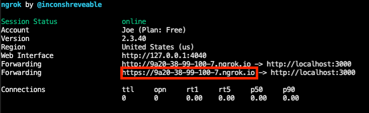

# Advanced Zoom Apps Sample

Advanced Sample covers most complex scenarios that might be needed in apps.

App has reference implementation for:
- Authentication flows: marketplace authentication, in-client authentication, third-party auth providers
- REST API calls and retrieving user information
- Zoom Apps SDK methods and events, including role-based permissions
- Guest mode

Tech stack: react js, node.js, express, docker (optional)

## Usage

Requirements:

- Docker
- Ngrok or another reverse proxy

### Setup .env files

Please see the `.env.example` file in the repository.

- Create a `.env` file by copying the example and filling in the values
  - If you are in development, use the Client ID and Client secret under `Development`
  - Lines starting with a '$' are terminal commands; you'll need the openssl program.  Run the command in your terminal and capture the output, or you can use what those values are currently set at for now.
  - Note that the three 'AUTH0' - prefixed fields are optional - see instructions for the Third Party OAuth below.  Leaving out any of these three values will disable this demonstration feature.

### Start your Ngrok (reverse proxy)

Zoom Apps do not support localhost, and must be served over https.  To develop locally, you need to tunnel traffic to this application via https, because the application runs in Docker containers serving traffic from `http://localhost`. You can use Ngrok to do this. Once installed you may run this command from your terminal:

```bash
ngrok http 3000
```

Ngrok will output the origin it has created for your tunnel, eg `https://9a20-38-99-100-7.ngrok.io`. You'll need to use this across your Zoom App configuration in the Zoom Marketplace (web) build flow (see below).

Please copy the https origin from the Ngrok terminal output and paste it in the `PUBLIC_URL` value in the `.env` file.


Please note that this ngrok URL will change once you restart ngrok (unless you purchased your own ngrok pro account).  If you shut down your Ngrok (there's no harm to leaving it on), upon restart you'll need to copy and paste the new origin into the `.env` file AND also to your Marketplace build flow.

### Setup in Zoom Marketplace app build flow

The Zoom Marketplace build flow for a Zoom App may be found [here](https://marketplace.zoom.us/develop/create).  You will need a developer account with Zoom Apps enabled.

The following are steps to take in each of the tabs in the build flow . . .

#### App Credentials


If you enabled the "List app on Marketplace to be added by any Zoom user" toggle while creating your app on the Marketplace, you will see the following two sections: Development and Production.
Note: The above option should only be selected if you intend to publish the app to the marketplace. This option can be enabled later as well under the "Activation" tab. The "Activation" tab only appears if you have not selected to list the app to be published 

`your Ngrok origin` = ie. `https://9a20-38-99-100-7.ngrok.io`
Follow these instructions for the "Development" section
- Add `<your Ngrok origin>/api/zoomapp/home` in the Home URL field
- Copy and paste your Client ID and Client secret (from the "Development" section, not "Production" section) into the `.env` file for this application
- Add `<your Ngrok origin>/api/zoomapp/auth` in the Redirect URL for OAuth field
- Add `<your Ngrok origin>/api/zoomapp/auth` in the OAuth allow list
- Add `<your Ngrok origin>/api/zoomapp/proxy#/userinfo` in the OAuth allow list
  - Not needed if you are not using in-client oauth.  This is the exact window location where authorize method is invoked
- Add your Ngrok domain only (no protocol, eg `9a20-38-99-100-7.ngrok.io`) in the Domain allow list
- Add the SDK url `appssdk.zoom.us` in the Domain allow list
- Add `images.unsplash.com` to the Domain allow list
- Add any other required domains (eg `my-cdn.example.com`) in the Domain allow list*

*Important: All requests to domains **NOT** in the Domain allow list in the app's Marketplace build flow will be blocked in the Zoom Apps embedded browser

#### Information

- Please fill out the developer contact name and developer contact email fields to test the application locally. In order to submit the application for review, you will need to fill out the rest of the fields. 

#### Features

- Under `Zoom App SDK` click **Add APIs**
  - For the purposes of this app, please add the following APIs and events:
    - `allowParticipantToRecord`
    - `authorize`
    - `cloudRecording`
    - `connect`
    - `expandApp`
    - `getMeetingContext`
    - `getMeetingJoinUrl`
    - `getMeetingParticipants`
    - `getMeetingUUID`
    - `getRecordingContext`
    - `getRunningContext`
    - `getSupportedjsApis`
    - `getUserContext`
    - `listCameras`
    - `onActiveSpeakerChange`
    - `onAuthorized`
    - `onConnect`
    - `onMeeting`
    - `onMessage`
    - `onMyUserContextChange`
    - `onSendAppInvitation`
    - `onShareApp`
    - `openUrl`
    - `postMessage`
    - `promptAuthorize`
    - `removeVirtualBackground`
    - `sendAppInvitation`
    - `shareApp`
    - `showAppInvitationDialog`
    - `sendAppInvitationToMeetingOwner`
    - `sendAppInvitationToAllParticipants`
    - `setVideoMirrorEffect`
    - `setVirtualBackground`
    - `showNotification`
  - Users will be asked to consent to these scopes during the add flow before being allowed to use the Zoom App
  - Important: The added or checked items must at least include those in the "capabilities" list in the call to zoomSdk.config in the embedded browser, eg frontend/src/App.js
- Select any additional features you would like to enable, eg Guest mode, In-client OAuth, Collaborate mode, etc. For this app, have Guest mode, In-client OAuth, and Collaborate Mode turned on.
  - Important: For legacy reasons, Guest mode is NOT enabled by default. Please make sure your app supports this - particularly relevant for applications live prior to June 2022. Newer applications will want to take advantage of these features from the start


#### Scopes

- Add the following Scopes required for this Advanced Sample Zoom App: `zoomapp:inmeeting`, `user:read`
  - The Scopes referred to here are for the Zoom API - they are not exclusive to Zoom Apps. Please find documentation for the Zoom API [here](https://marketplace.zoom.us/docs/api-reference/introduction)
  - As with the Zoom App SDK APIs and events from the 'Features' tab, scopes selected here will be presented to users for consent before they may use the Zoom App.


## Start developing

### Start containers

- Use the `docker-compose` tool from the root directory to start both the backend and frontend containers:

```
docker-compose up
```
  - Now, you should be getting logs from both the express server/backend and the webpack-dev-server that serves the frontend.

### Install the app

Before proceeding, make sure to:
  - Log in to zoom.us on the web (if not already signed in there)
  - Make sure the user matches the user you've used to log in to the Zoom client 
  - While developing, make sure the user is in the developer account

To install your app and open it the Zoom client's embedded browser, visit:

```
<your Ngrok origin>/api/zoomapp/install
```
 
Any errors you encounter during the add flow are likely related to user mismatches or different/non-developer accounts.  You may also want to double check that your Client ID and Client secret (in the `.env` file) are up to date.


### Validate It's Working
After hitting the install URL, an authorization page will show up in the browser. After reviewing and accepting the permissions, the browser will prompt a redirect (AKA deeplink) to the Zoom Client. The client should open up and you should see the Reference App running in your client


### Develop

#### UI

The React-based UI will hot reload automatically with changes, thanks to the Webpack dev server.  Visit each of the Zoom APIs demoed and test their functionality.

#### Server

The backend will update live with any changes as well, thanks to the nodemon npm package.

The server will persist sessions for each device (eg system browser or embedded browser/Zoom client) that visits. A common mistake is to restart the Docker containers expecting user data to persist.  This will cause problems.  You should plan to revisit the install flow every time you restart your Docker containers.

#### Logs and Enabling Developer Tools

Look for helpful logs from the frontend by opening the browser developer tools console in the Zoom Apps embedded browser (you must enable it first - see following instructions), and from the backend in your terminal window.

To enable the developer tools in the Zoom client:
- For MacOS, run this command in your terminal:

```
defaults write ZoomChat webview.context.menu true
```

- For Windows machines:
    - Find your local Zoom data folder, eg `C:\Users\<username>\AppData\Roaming\Zoom\data`
    - Find the "zoom.us.ini" file or create one if it does not exist
    - Paste in this line and save:

```
[ZoomChat]
webview.context.menu=true
```
After following the above instructions, **Right Click** -> **Inspect Element** in the embedded browser (Zoom Apps panel in the Zoom client) to see the developer tools.

### App Components

#### Frontend

This Zoom App uses [create-react-app](https://create-react-app.dev/) for the frontend component. The express server/backend provides a proxy for this, so that it also can sit behind the Ngrok origin that you create.

The frontend app is quite simple:
- It calls a Zoom REST API endpoint for user data via a backend-hosted proxy that adds user access token to the request
- It imports the Zoom SDK in `index.html` via a script `<script src="https://appssdk.zoom.us/sdk.min.js"></script>`
- Offers an example Zoom App SDK configuration to get the running context of the Zoom App.
- Includes examples of Zoom App SDK method invocations

#### Backend

The backend is a NodeJS/Express server. The routes include:

- A home route to initialize a cookie-based session for embedded browser users
- A proxy for the Zoom App frontend - serves frontend files from the frontend container
- A proxy for the Zoom REST API - adds user access token and calls Zoom API from the server
- Routes for the traditional/web-based add flow: install and authenticate
- Routes for In-client OAuth add flow: authorize and on authorize
- Routes for the 3rd Party OAuth flow (optional; example using an example Auth0 application)

#### Database

Redis:
- Stores session data (cookie-based sessions using the express-session npm library)
- Stores application data (users, access tokens for Zoom API and 3rd Party OAuth provider)


## Third party authentication example - optional and using Auth0

The third party authentication example is optional - if you skip these steps, please leave the 'Auth0' - prefixed fields in the `.env` file empty or remove them entirely.  Leaving out any of those three values from the `.env` file will disable this demonstration feature.

- Auth0 steps for set up:

  1. Sign up for an account [here](https://auth0.com/signup?place=header&type=button&text=sign%20up)
  2. Create an application
  3. Select `Regular Web Applications`
  4. Select `Auth0 Management API` (Doesn't really matter here)
  5. Permissions: Select `All`
  6. In the section `Application Properties`, make sure (or change) `Token Endpoint Authentication Method` to `Post`
  7. In the section `Application URIs`, fill in `Allowed Callback URLs` with `https://<your Ngrok origin>/api/auth0/auth` and `Allowed Web Origins` with `https://<your Ngrok origin>`
  8. Under `Advanced Settings` -> `Grant Types`, check `Authorization Code`
  9. Save Changes
  10. Under `User Management` in the left-hand panel, select `Users` and create a user with username and password.
  11. During the auth flow, use the credentials created in `Step 9` to login.


## What do I do next?

Start building your app! You can check out the [Zoom Apps developer docs](https://developers.zoom.us/docs/zoom-apps/) for more information on the JS SDK. You can also explore the [Zoom REST API](https://developers.zoom.us/docs/api/) or use the third party OAuth to call a different API.
